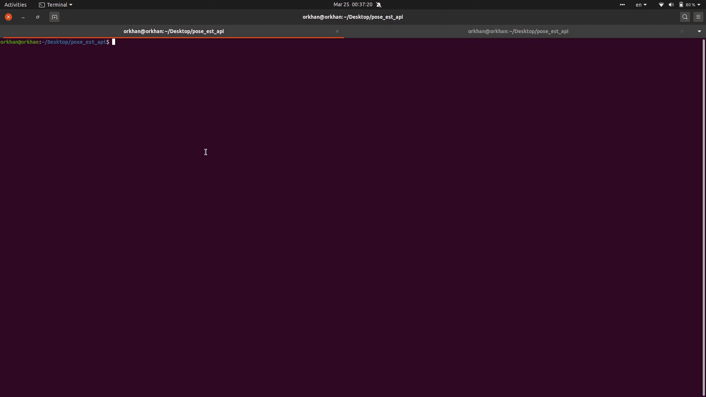

# POSE ESTIMATION API
---

This repository is API based Body and Hand Pose Estimation.
<br>
<br>


## Really Simple :)
Just run the server and request to the server with any image file which contains body and hand(for hand body is required) That's all :)

### Okay what is the workflow?
* You should install packages. (descripted inside of requirements.txt)
* Run the server for the requests
* Request to the server with image
* Get your response and Enjoy :)

#### How can you install packages?

Install PyTorch by following the quick start guide [here](https://download.pytorch.org/whl/torch_stable.html) (use pip) 


For another requirements, just run command below.

``` bash
$ cd pose_est_api/
$ pip3 install -r requirements.txt
```

#### For quick start you can install models from link below
[dropbox](https://www.dropbox.com/sh/7xbup2qsn7vvjxo/AABWFksdlgOMXR_r5v3RwKRYa?dl=0)

**Download the pytorch models(.pth) and put them in a directory named _model_ in the project root directory**

#### After you have installed those packeges, what you will do next?

Now you can run your server first.

``` bash
$ uvicorn post_est:app --reload
```
Then you should be get the messages below:
 
``` bash
INFO:     Uvicorn running on http://127.0.0.1:8000 (Press CTRL+C to quit)
INFO:     Started reloader process [76894] using statreload
INFO:     Started server process [76896]
INFO:     Waiting for application startup.
INFO:     Application startup complete.
```

#### Let's try the server
For testing the server you can use _req.jpg_.

```bash
$ python3 main.py req.jpg
```
What is your response? 

``` bash
Do you want to save response image? [y/N]: y
```
After said yes, you get message below:

```bash
image saved as res.jpg
```

## [IMPORTANT!]
You can configure post json context from _main.py_.
If you want to draw position keypoints of hand you should define value of "hand_pose" as 1.
To draw rectangle for right and left hands(if it exists) you should define "which_hands" as 1.
